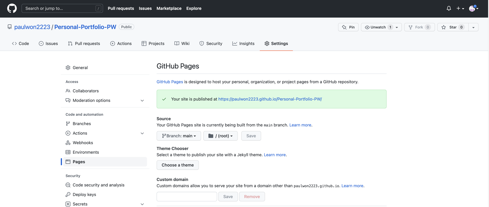
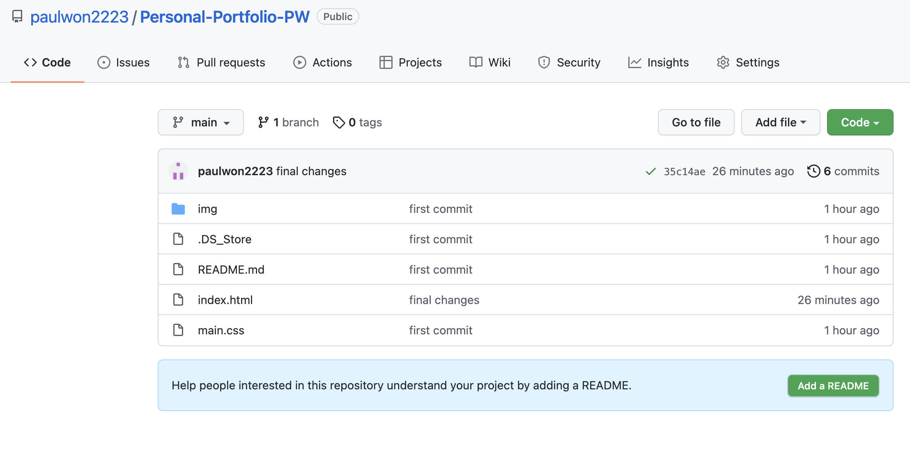

# Homework Assignment #2

## Overview:

- For this homework assignment, I was to create a personal portfolio that can be accessed to future employers that displays information about my self and the projects I have accomplished.

## Portfolio:
- During my process in creating my portfolio, I wanted to priortize in creating a user friendly website in which users and easily navigate through. To do so, I first created a working nav bar which lists all the different secions within my webiste that directly guides the user to the specific desired section. In addition, I also included scroll buttons throughout my webiste to help users easily navigate through the website.

- Furthermore, I added a 'media query' set on specific width values to create a responsive element that will adapt to the users device.

## Additional Attatchments:
- link to my github page: https://paulwon2223.github.io/Personal-Portfolio-PW/

- link to my repository: https://github.com/paulwon2223/Personal-Portfolio-PW

